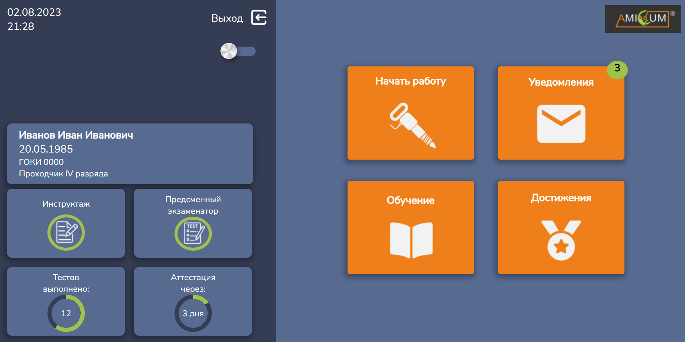

# amicum

## Страница программы

- Страница авторизации;
- Основная страница;
- Кнопка выхода из личного профиля;
- Смена темы светлая/тёмная;
- Все плитки кликабельны и перенаправляют на соответсвующую страницу;
- Форматированный вывод даты и времени (если в них всего одна цифра, то автоматически подскавляется '0');
- Подключён роутер для перехода по страницам и возвращению назад;
- Данные карточек не статичны, а генерируются из блока data в компоненте через цикл;
- UI компоненты - прогрессбар и значок уведомлений;

## Установка
 - клонировние репозитория;
 - установка необходимых пакетов - npm i
 - npm run serve
 - перейти на localhost